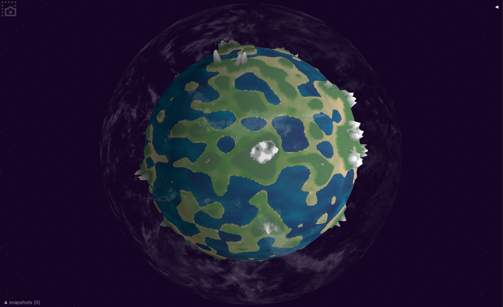
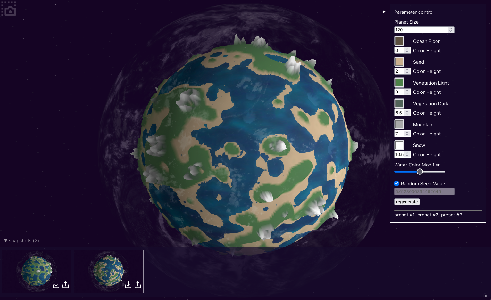
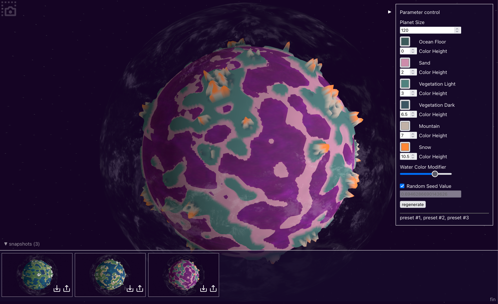

# PlanetGenerate

Planet Generator by Vincent
for a traineeship assignment
Build in ±8 hours.

## Assignment:

This case forms the input for your presentation. We are keen to find out more about your insights, way of thinking and your skills. There’s no right or wrong in your answers. This assignment is both for you and us to see if we could be a match.

We have an ambitious challenge for you. You’ll be creating a program that generates planets. Our estimation is that in 8 hours, you’ll get pretty far.
It’s up to you to choose which programming language and framework you will use.
The program you will build should be able to do the following:

- A planet (such as the Earth) should be visible on screen. Whether it is in a window or on a browser doesn’t matter.
- It might be handy if the planet rotates or is rotatable.
- On command, you can generate a new planet. Either by refreshing or pushing a button.

These are the requirements. A planet should at least consist of:

- Water
- Earth
- Mountains
- Snowy tops

Next to that:

- The terrain needs to be randomly generated.
- How far you want to go is up to you. You can do textures, or also shape the actual planet.
- In case you want to go all out, you can vary the landscapers, the shape of planets or anything else you think is cool to show.

You are in charge of what to present and how to present it. Be creative and have fun. We are curious about what you’ll make.
Good luck!

## Installation

- run `npm install`
- run `npm run dev`
- go to [http://localhost:5173/](http://localhost:5173/)

## Approach

I used noise generation functions to displace coordinates on a 3d spherical shape. This creates the "mountains". The height is used to give colors. The water is a seperate layer that covers the "low" parts of the planet and can be individually colored.

I decided to add functionality to change all the available colors through a simple pull-out modal on the right of the screen. There you can also control the "random seed", so you can change the color settings with the same mountains.

Lastly I added a screenshot functionality to save the state for if you liked something.

## Result

The company was looking less for a technical approach and more for "ideas behind it". Their feedback was that it was "almost too pretty", they were looking more for an academical mindset to what the tool could be used for than a finished product. Since this was not clear to me from the assignment description this was not what I had prepared for and I managed not to answer those questions very well during the presentation. (I was not picked for the traineeship ;-)). Better luck next time :) But I had fun building this
